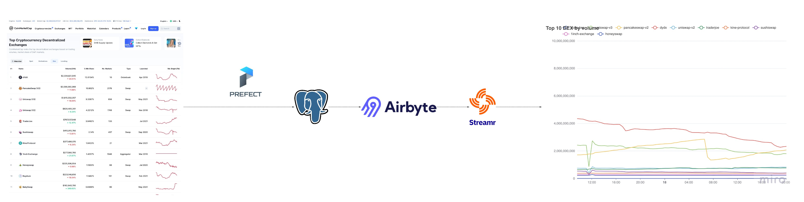

# Realtime chart DEX volume via Streamr

Proof of concept to stream data via Streamr and display as realtime chart

[Demo](https://streamr-dex-chart.vercel.app/)

_The data is update each 30 mins_

## Stack

- [Prefect to load data](https://github.com/thanhlmm/prefect_cmc)
- [Streamr Airbyte connector ](https://github.com/devmate-cloud/streamr-airbyte-connectors) to sync data from Postgres to Streamr
- [echarts](https://echarts.apache.org/en/index.html) to display data
